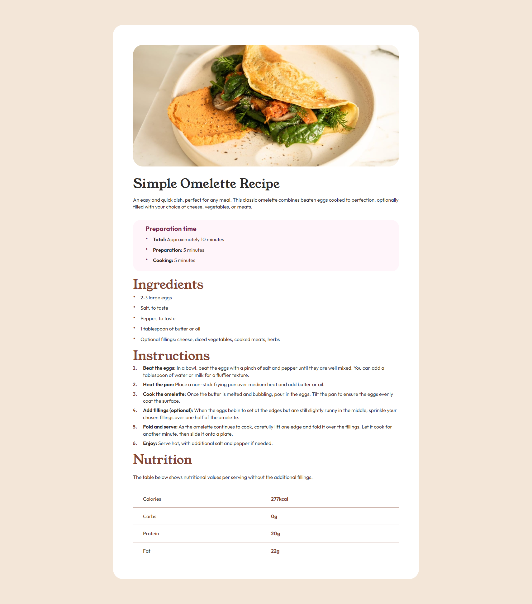
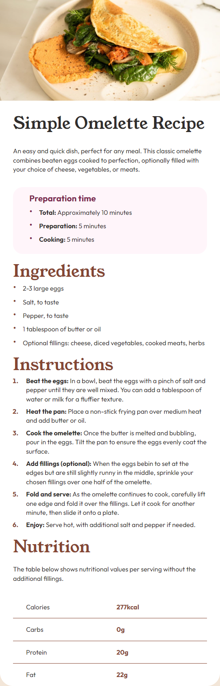

# Frontend Mentor - Recipe Page solution

This is a solution to the [Recipe Page challenge on Frontend Mentor](https://www.frontendmentor.io/challenges/recipe-page-KiTsR8QQKm). Frontend Mentor challenges help you improve your coding skills by building realistic projects.

## Table of contents

- [Frontend Mentor - Recipe Page solution](#frontend-mentor---recipe-page-solution)
  - [Table of contents](#table-of-contents)
  - [Overview](#overview)
    - [The challenge](#the-challenge)
    - [Screenshot](#screenshot)
    - [Links](#links)
  - [My process](#my-process)
    - [Built with](#built-with)
  - [Author](#author)
  - [Help](#help)

## Overview

### The challenge

Users should be able to:

- See the description of a recipe
- See preparation time
- See the ingredients
- Follow the recipe instructions
- Have information about the nutrition of the recipe

### Screenshot




### Links

- [Github](https://github.com/Thomas-Bezille/FrontEnd-Mentor_Recipe_page)
- [Live]()

## My process

### Built with

- HTML
- CSS
- Python
- Django

## Author

- Frontend Mentor - [@Thomas-Bezille](https://www.frontendmentor.io/profile/Thomas-Bezille)
- Twitter - [@ThomasBzie](https://twitter.com/ThomasBzie)

## Help

1. Clone the repo
2. Activate the virtual environment

   ```bash
   source .env/Scripts/activate
   ```

3. Start the server

   ```bash
   py src/manage.py runserver
   ```

4. Go

   ```text
   http://127.0.0.1:8000/recipe/
   ```
